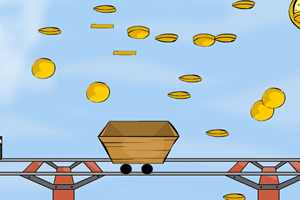

# Final Project

## Final Code Plan

This project is a small game where the user can use the arrow key on the key board to travel through the map to find different body parts of the snowman.

First, I will move the background using imgage center mode and change the position of the center point as the arrow key being pressed to create the effect as if the user is traveling through the map. Then I will place images of the different body parts of the snowman all over the map for user to find. I will use the distance calculation to constantly checking the distance between user and all body parts. As user come to those body parts, meaning when the distance is smaller than 20, by using if statements, I will make the image of that particular body parts on the map disappear, than make the same image show up in the bottom-right corner to create the body part being picked up effect. When user found all body parts of the snowman, I will use play library to create an animation effect with a text congratulating  the user finding everything.

There will also be a sound library to load a background music and various audio notification when parts are picked up. There will also be a snowing effect using function.

## Ideas

### 1. Snowman
I will create a snowman with buttons for interaction (changing background, starting snowflake, some sound effect).

This project is a small game where the user can use the arrow key on the key board to travel through the map to find different body parts of the snowman.

### 2. Map game
A game that a character can move along the canvas map. As he moves past different points of the map, various events will happen accordingly.
First, I will move the background using imgage center mode and change the position of the center point as the arrow key being pressed to create the effect as if the user is traveling through the map. Then I will place images of the different body parts of the snowman all over the map for user to find. I will use the distance calculation to constantly checking the distance between user and all body parts. As user come to those body parts, meaning when the distance is smaller than 20, by using if statements, I will make the image of that particular body parts on the map disappear, than make the same image show up in the bottom-right corner to create the body part being picked up effect. When user found all body parts of the snowman, I will use play library to create an animation effect with a text congratulating  the user finding everything.

### 3. Collecting gold coins
I will create a game with a little man collecting gold coins. Within the game, there will be sound effects, and maybe option to change the background, etc. 

