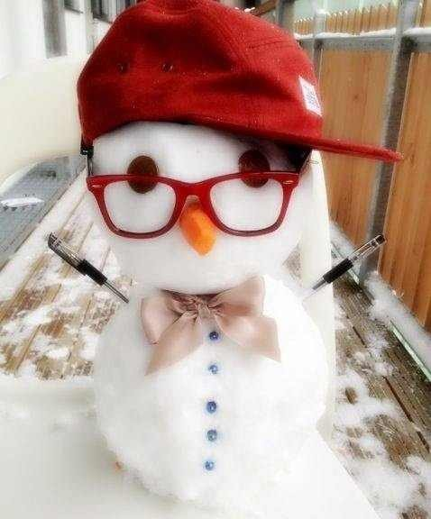

# Final Project

## Ideas

### 1. Snowman
I will create a snowman with buttons for interaction (changing background, starting snowflake, some sound effect).

### 2. Map game
A game that a character can move along the canvas map. As he moves past different points of the map, various events will happen accordingly.

### 3. Collecting gold coins
I will create a game with a little man collecting gold coins. Within the game, there will be sound effects, and maybe option to change the background, etc. 

## 1st Code Plan

This project is a small game where the user can travel through the map to find different body parts of the snowman as different things happen.

First, I will track user's mouse and move the background accordingly to create the effect as if the user is traveling through the map. Then I will create different hitzone and button on the backroung map to triger different events. Then, I will create messages and effects accordingly to return effects to user.